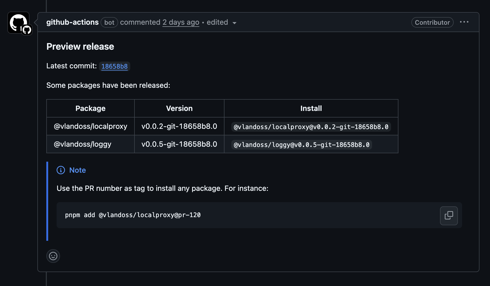

# Monorepo preview release

This Github action creates a preview release of your package and comments on the pull request with the release information.



## Usage

```yml
- name: 🚀 Preview release
  uses: variableland/gh-actions/actions/monorepo-preview-release@main
  with:
    github_token: ${{ secrets.GITHUB_TOKEN }}
    auth_token: ${{ secrets.NPM_TOKEN }} # optional
```

## Requirements

- [pnpm](https://pnpm.io)
- [Bun](https://bun.sh)

> [!TIP]
> You can use the [setup-pnpm-bun](../setup-pnpm-bun/README.md) action to set up pnpm and Bun in your workflow.

## Example

```yml
name: CI

on:
  pull_request:
    branches:
      - main

concurrency:
  group: ${{ github.workflow }}-${{ github.ref }}
  cancel-in-progress: true

jobs:
  # other steps like test...

  preview:
    runs-on: ubuntu-latest
    needs: test
    if: ${{ startsWith(github.head_ref, 'feat') || startsWith(github.head_ref, 'fix') }}
    steps:
      - name: ⬇️ Checkout repo
        uses: actions/checkout@v4

      - name: ⌛ Setup CI
        uses: variableland/gh-actions/actions/setup-pnpm-bun@main

      - name: 🚀 Preview release
        uses: variableland/gh-actions/actions/monorepo-preview-release@main
        with:
          github_token: ${{ secrets.GITHUB_TOKEN }}
          auth_token: ${{ secrets.NPM_TOKEN }} # optional
```
